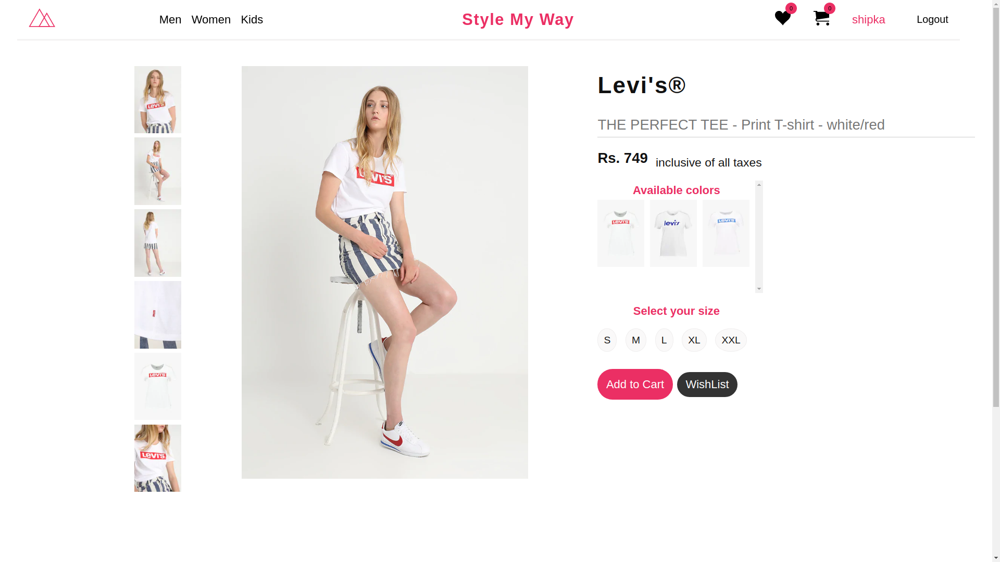

# Show_time

A movie booking website

# Quick Start

clone it and keep it in a python virtualenv

# Install React dependencies

npm install

# Install Python dependencies
pip install --

django,

djangorestframework,

Pillow,

django-rest-knox,

mysql-connector-python

# Search movies by name 
# Filter movies by Genre,Language

# ChatBot Feature included

# Go through complete details of the movie

# Theatres in which a movie is being screened

# Seating Plan

# Snacks and ticket confirmation

